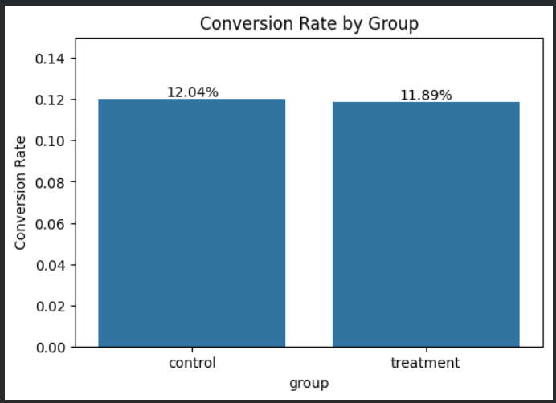
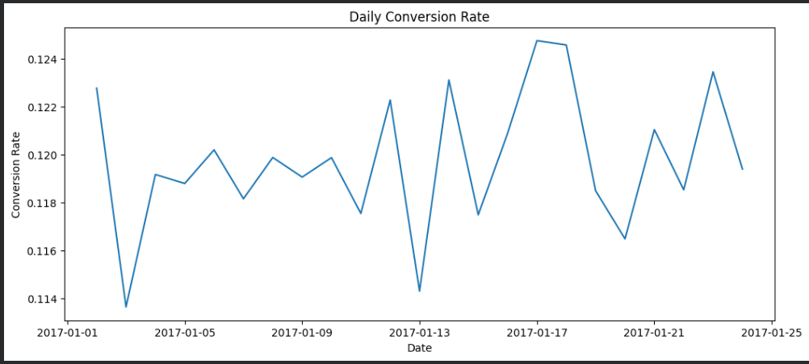
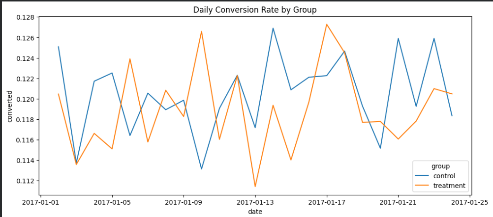

# A/B Testing and Conversion Rate Optimization Analysis

## Project Overview

This project evaluates whether a new landing page improves user conversion rates compared with an existing landing page.

## Business Problem

A company introduced a new landing page and wanted to determine whether it increased user conversion rates.

## Dataset

- 294,478 user observations
- Control and treatment groups
- Country-level information
- Conversion outcomes

## Methods

- Exploratory Data Analysis
- Conversion Rate Analysis
- Chi-Square Hypothesis Testing
- Country-wise Analysis
- Data Visualization

## Key Findings

- Overall conversion rate: 11.97%
- Control conversion rate: 12.04%
- Treatment conversion rate: 11.89%
- p-value: 0.2182

## Conclusion

The new landing page did not produce a statistically significant improvement in conversion performance.

## Tools Used

- Python
- Pandas
- NumPy
- SciPy
- Matplotlib
- Seaborn
- Google Colab

  ## Visualizations

### Conversion Rate by Group

### Daily Conversion Rate

### Daily Conversion Rate by Group

### Conversion Rate by Country

